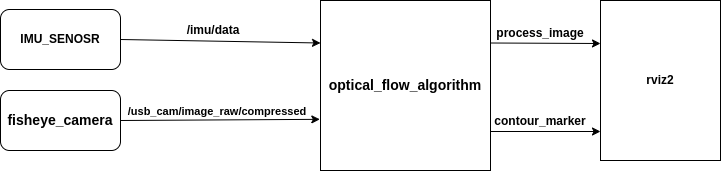

# Visual Odometry Algorithm Based on Optical Flow

## Overview
This project develops a robust visual odometry algorithm leveraging optical flow theory and data fusion techniques within the ROS2 framework. It estimates the trajectory of a moving platform by analyzing sequences of images from an onboard camera directed to the ground and data from an Inertial Measurement Unit (IMU). The fusion of these data sources is managed through a Kalman filter, ensuring enhanced accuracy and reliability of the trajectory estimates in a ROS2 environment.
- This package is exclusively built for ROS2. It is being tested on Ubuntu 22.04 with ROS2-Humble.
- **Docker Support**: The project includes Dockerfile specifications for building and running in Docker containers, making it easy to set up and use in diverse environments without the need for extensive local configuration.

## Algorithm Overview

Below is a diagram illustrating the input and output interactions of the visual odometry algorithm:



- **/imu/data/**: Subscribes to IMU data for motion and orientation metrics.
- **/usb_cam/image_raw/compressed**: Subscribes to image data from a USB camera.
- **process_image**: Publishes computed optical flow fields.
- **contour_marker_topic**: Publishes trajectory data for visualization in RViz.

## Key Features
- **Optical Flow Utilization:** Utilizes optical flow algorithms to compute motion between successive camera frames, providing detailed motion vectors that contribute to trajectory estimation.
- **Data Fusion with Kalman Filter:** Employs a Kalman filter to effectively fuse visual data from the camera and motion data from the IMU. This approach mitigates errors inherent in each sensor, leading to more precise motion tracking.
- **ROS2 Integration:** Fully integrated with the ROS2 ecosystem, facilitating easy deployment and scalability in robotic applications.
- **Robust to Various Conditions:** Designed to perform under varying lighting and environmental conditions, ensuring reliable operation in both indoor and outdoor scenarios.
- **Real-Time Processing Capabilities:** Optimized for real-time performance, suitable for applications requiring immediate feedback such as autonomous vehicles and robotic navigation.

## Prerequisites
- **ROS2 Installation:** This project requires a working installation of ROS2. Follow the official ROS2 installation guide [here](https://docs.ros.org/en/rolling/Installation.html).
- **Python 3.x:** Ensure Python 3.7 or newer is installed.
- **Camera and IMU Hardware:** Compatible camera and IMU sensors properly configured for use with ROS2.

## Installation
1. Install ROS2 and necessary tools:
    ```bash
    source /opt/ros/<ros2-distro>/setup.bash
    sudo apt update
    sudo apt install python3-colcon-common-extensions
    ```
2. Set up your ROS2 workspace:
    ```bash
    mkdir -p ~/ros2_ws/src
    cd ~/ros2_ws/src
    git clone [https://github.com/Asaf2445/visual_odometry_project.git]
    cd ..
    colcon build
    source install/setup.bash
    ```
3. Install additional ROS packages:
    ```bash
    sudo apt install ros-<ros2-distro>-opencv
    ```
4. Install Python dependencies:
    ```bash
    pip install -r requirements.txt
    ```
## Detailed Usage and Configuration

### IMU Data Requirements
The algorithm requires IMU data, specifically orientation data in quaternion format, which is consumed from the `/imu/data` topic. If your IMU sensor does not provide orientation data directly in quaternion format, you will need to implement an additional node that estimates and publishes this orientation. This node should subscribe to whatever orientation data your IMU provides (e.g., Euler angles, raw gyroscopic data), convert this data into quaternion format, and publish it to the `/imu/data` topic.

### Configurable Topic Names
The system is designed to be flexible with respect to the ROS topics from which it subscribes and to which it publishes. All topic names can be configured to accommodate your specific setup or preferences. This is managed through a configuration file, which allows you to specify the topic names used by the system.

#### Configuring Topics
To adapt the visual odometry algorithm to your needs, modify the topic names in the provided configuration file as follows:

1. **Open the Configuration File**:
   - Navigate to the `config` folder in the project directory.
   - Open the `config.yaml` file.

2. **Modify Topic Names**:
   - You will see entries for each topic that the system uses, such as `imu_topic` and `camera_topic`. Replace the default values with the names of the topics  published by your sensors and desired output topics.

3. **Camera Type**:
   - you can specify the type of camera you are using. Set `fisheye_camera: TRUE` if you are using a fisheye camera, which requires specific calibration and processing due to its wide-angle lens characteristics. Set it to `FALSE` if you are using a regular camera. This setting helps the system adjust its processing algorithms to suit the camera's lens type.

4. **Params**:
   - Adjust the camera's mounting height above the ground in millimeters (mm). 

### Camera Calibration

To ensure the highest accuracy of the visual odometry, it is crucial to calibrate your camera specifically for conditions that include wide-angle (fisheye) lenses. Calibration parameters are managed in the `camera_calibrate_params.py` file, which should be updated with your camera's specific calibration results.

#### Calibration Steps
1. **Calibrate Your Camera**: Use tools like OpenCV's calibration toolkit with a checkerboard to capture calibration images.

2. **Update Calibration Parameters**: Adjust the focal lengths (`fx`, `fy`), principal point (`cx`, `cy`), and distortion coefficients (`k1`, `k2`, `p1`, `p2`, `k3`) in the `camera_calibrate_params.py`.

3. **Implement in Project**: Ensure these values accurately represent your camera setup to correct image distortions effectively, crucial for precise optical flow and trajectory computations in environments suited to fisheye cameras.

Following these steps will help maintain system accuracy and reliability across different operational scenarios and camera setups.

## Using Docker with Visual Studio Code
To use this project within a Docker container managed by Visual Studio Code, follow these steps:

1. **Ensure Docker is Installed**: Make sure you have Docker installed and running on your machine.

2. **Install Visual Studio Code and the Remote - Containers Extension**:
   - Download and install [Visual Studio Code](https://code.visualstudio.com/).
   - Install the [Remote - Containers extension](https://marketplace.visualstudio.com/items?itemName=ms-vscode-remote.remote-containers) from the VS Code marketplace.

3. **Prepare Your System for GUI Applications**:
   - To allow GUI applications running inside Docker containers to display on your host system, you need to run the following command in your terminal. This command grants access to the X server for local connections from the root user inside the Docker container:
     ```bash
     xhost +local:root
     ```
   - This step is crucial for systems where the Docker container needs to interface with the host's display, commonly required for graphical applications like RViz in ROS.

4. **Open the Project in a Container**:
   - Open Visual Studio Code.
   - Press `Ctrl+Shift+P` to open the command palette.
   - Type `Remote-Containers: Open Folder in Container...`, and select the folder where you cloned the project.
   - VS Code will build a Docker container according to the specifications in your Dockerfile or defined in the `.devcontainer/devcontainer.json` if available. This process may take a few minutes the first time.

5. **Configure the Container**:
   - Once the container is built and running, VS Code will automatically connect to it. You may need to install any required extensions inside the container when prompted by VS Code.
   - Open the terminal in VS Code (using ``Ctrl+` `` or through the Terminal menu) to interact with the ROS2 environment inside the container.

6. **Run the ROS2 Application**:
   - In the VS Code terminal, navigate to your ROS2 workspace:
     ```bash
     cd ~/ros2_ws
     ```
   - Source the ROS2 setup script:
     ```bash
     source install/setup.bash
     ```
   - Launch your visual odometry application:
     ```bash
     ros2 launch project_bringup optical_flow_app.launch.py
     ```
## License
This project is licensed under the MIT License - see the `LICENSE` file for details.

